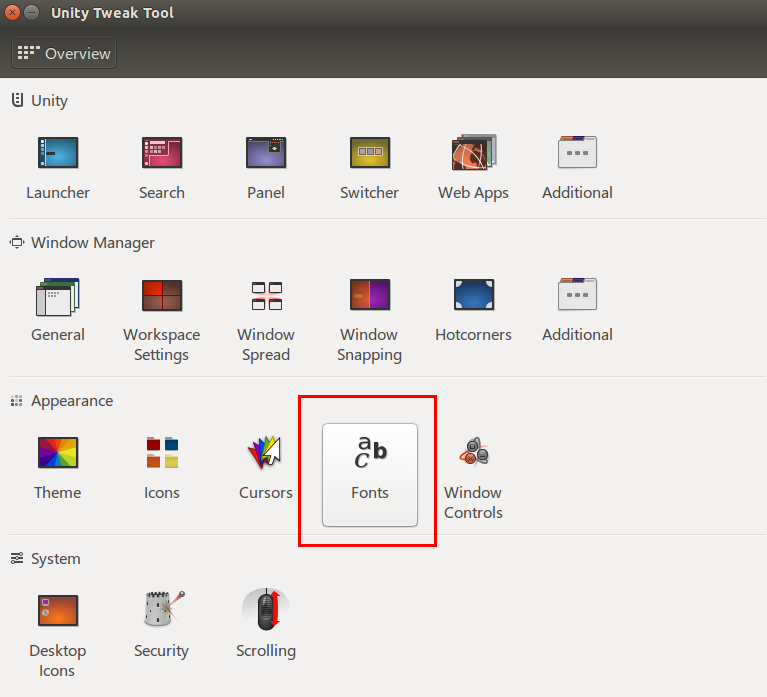
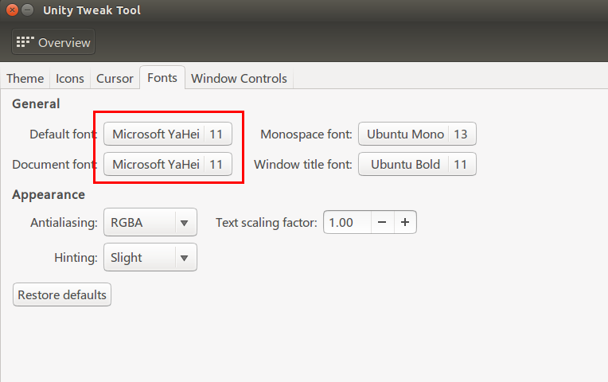

# 字体设置

我们知道ubuntu下没有微软雅黑，这会导致网页浏览很奇怪，可以使用以下步骤来为ubuntu安装微软雅黑字体。

首先在window下的c://window/Fonts 中找出`msyh.ttc`，将其拷贝出来

切换到ubuntu下，我们可以在/usr/share/fonts下创建一个文件夹，用于放置这个字体文件

```shell
cd /usr/share/fonts
sudo mkdire winfonts
```

之后将该字体文件拷贝到winfonts中，改变字体文件的访问权限，在winfonts文件夹下执行

```shell
sudo chmod 744 *
```

然后根据字体文件生成核心字体信息

```shell
sudo mkfontscale
sudo mkfontdir
sudo fc-cache -fv
```

之后注销一下即可。

接下来，就是要使用我们导入的微软字体，可以在软件中心搜索unity tweak tool，然后安装


之后打开软件，就可以进入font选项



然后就可以设置



