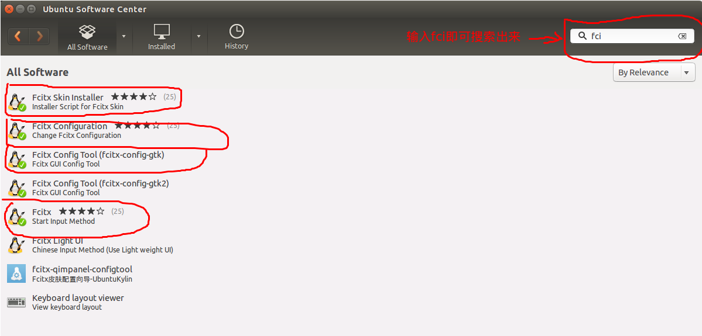
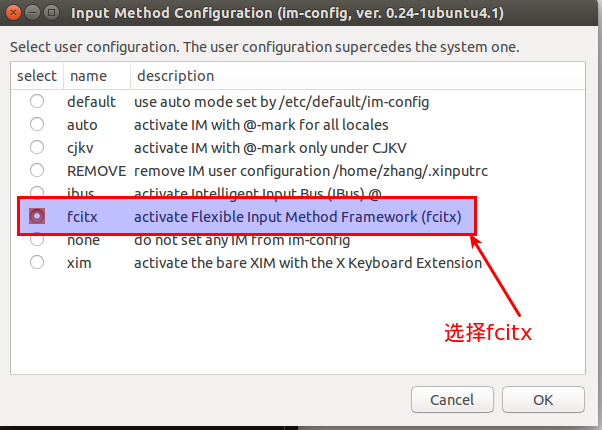
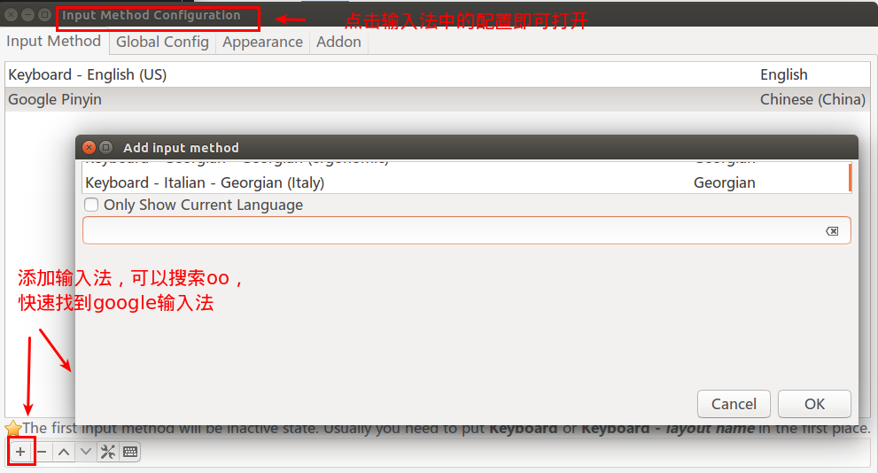

# 中文输入法 

环境:ubuntu 14.01 英文系统

## 1. 安装fcitx

打开软件下载中心，搜索fcitx，安装fcitx



## 2. 切换输入

1. 打开bash，输入input，打开input method

    

2. 一直进行下一步，直到

    

3. 然后点击直到结束，之后重启电脑，就可以看到

    

## 2. 安装搜狗拼音

下载[搜狗拼音的linux](http://pinyin.sogou.com/linux/?r=pinyin)

下载之后点击安装既可，之后就可以看到搜狗输入法


## 3. 安装googlepinyin

搜狗输入法有时候会有点问题，个人还是喜欢googlepinyin

安装了fcitx之后，再安装googlepinyin

```shell
sudo apt-get install fcitx-googlepinyin
```

之后可以在有上方的输入法中点击配置，新添我们安装的谷歌输入法

