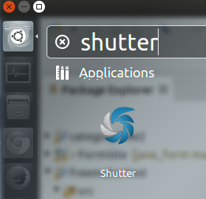
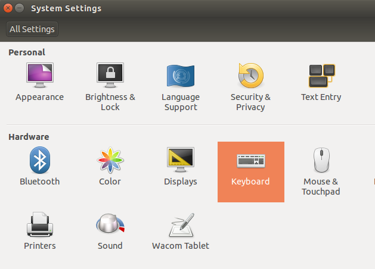
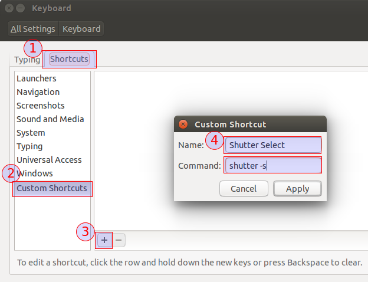
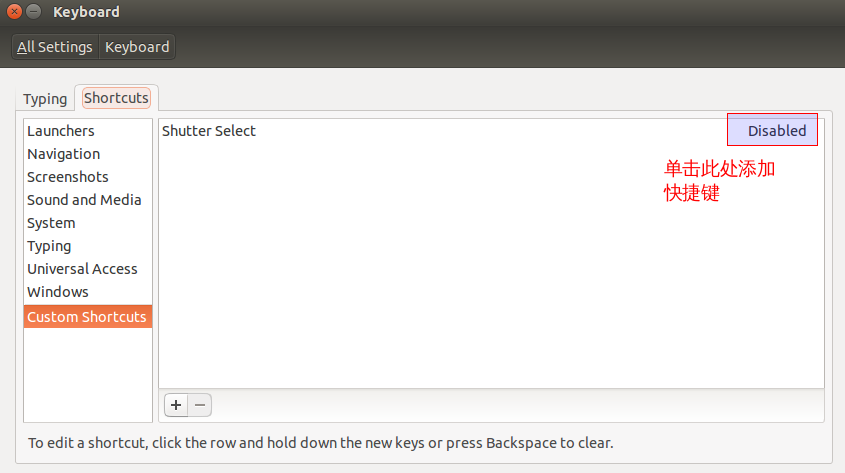
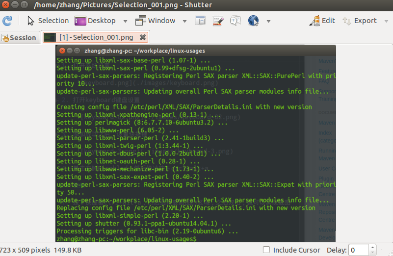
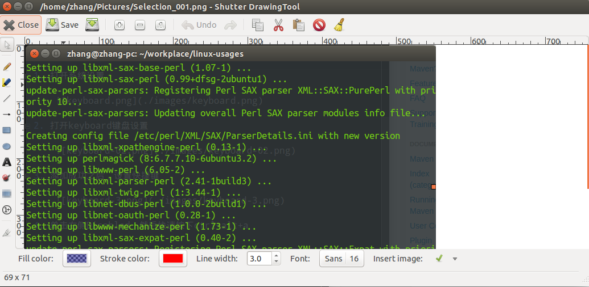

# 截图工具shutter

## 1. 添加软件源并安装

*如果没有添加，安装的shutter不是截图工具*

```shell
sudo add-apt-repository ppa:shutter/ppa
sudo apt-get update
sudo apt-get install shutter
```

安装成功后，在bash中搜索shutter



## 2. 设置快捷键

1. 打开系统设置

    

2. 打开keyboard键盘设置

    

3. 添加成功之后，设置快捷键

    

4. 单击右侧Disabled，然后快速按下ctrl+alt+a

## 使用

1. 按下快捷键ctrl+alt+a，然后选择要截图的区域，之后双击，就会出现

    

2. 这个时候已经截图成功了，我们可以进行进一步的编辑，点击edit,即可编辑

    