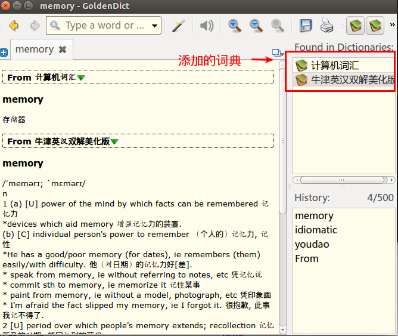

# 翻译软件

安装`goldendict`

```shell
sudo apt-get install goldendict
```

安装之后，需要自己添加词典，有几种形式

* 联网方式（添加一些网站）
* 离线的方式，下载一些本地的词典

打开词典


## 安装本地词典

[本地词典下载](http://luveelin.blog.163.com/blog/static/119492341201251943213676/)

点击列表中的tarbal直接下载即可。


下载之后解压，（下载了牛津现代词典和计算机词典）

```shell
tar -jxvf stardict-kdic-computer-gb-2.4.2.tar.bz2
tar -jxvf stardict-oxford-gb-formated-2.4.2.tar.bz2
```

创建一个`dictionaries`目录，将解压后的文件夹移到该目录下，然后打开词典，配置本地词典。

在edit->Dictionaries中，打开之后


然后搜索memory，即可看到这样的结果：

